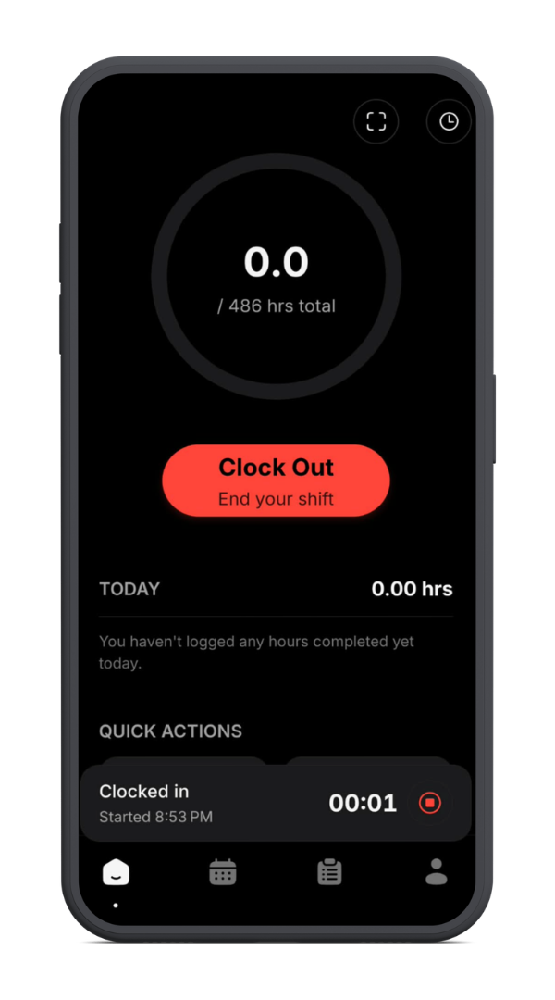
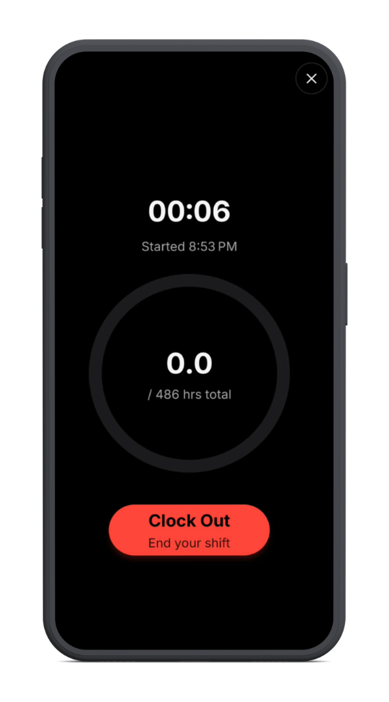
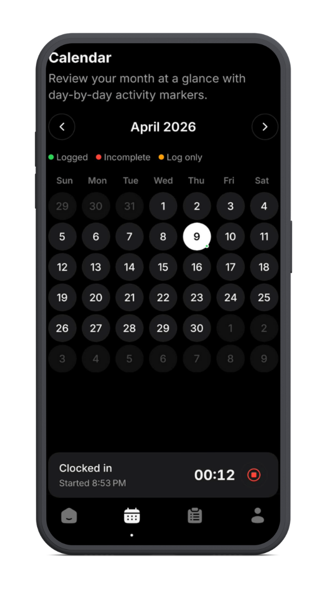
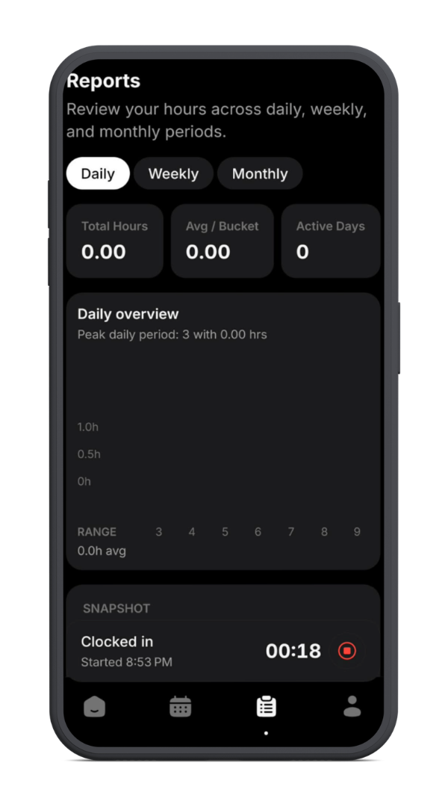
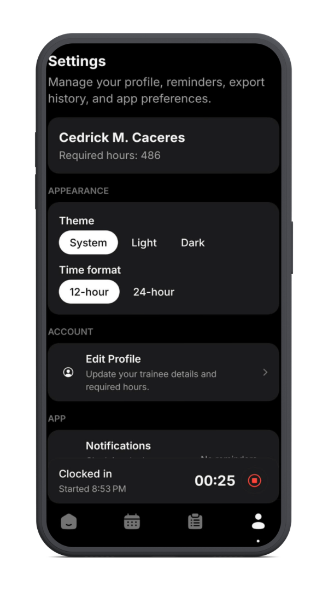

# ORender

<p align="center">
  
  
  
</p>

<p align="center">
  
  
</p>

## Intro

ORender is a mobile OJT attendance, logging, and reporting app built for students who need to track rendered hours, maintain daily work records, and generate professional submission-ready exports.

The app is designed around practical on-device workflows: clock in and clock out, manual attendance correction, daily logs with task completion, calendar review, reports, backup, and reminders.

This repository contains the main mobile application codebase.

## Project Scope

ORender currently includes:

- attendance tracking through clock in, clock out, and manual entries
- daily logs with editable task checklists
- calendar month view with day detail screens
- attendance history with filtering and search
- reports, insights, and export tools
- local reminders, backup, and profile settings


## Getting Started

Install dependencies:

```bash
npm install
```

Start the project:

```bash
npm run start
```

Useful commands:

```bash
npm run android
npm run ios
npm run web
npm run lint
```

## Thanks

Thanks to everyone who contributes ideas, feedback, bug reports, and code improvements to the project.

## License

MIT License. See [LICENSE](/Users/cedrick/Documents/GitHub/ojt-tracker/LICENSE).

## About ORender

ORender is being developed as a focused OJT record-keeping app for mobile-first use. The goal is to make attendance tracking, daily documentation, and report generation simple enough for day-to-day internship work while still producing records that are appropriate for adviser and school submission.

The project is public to make its implementation visible and easier to learn from.
